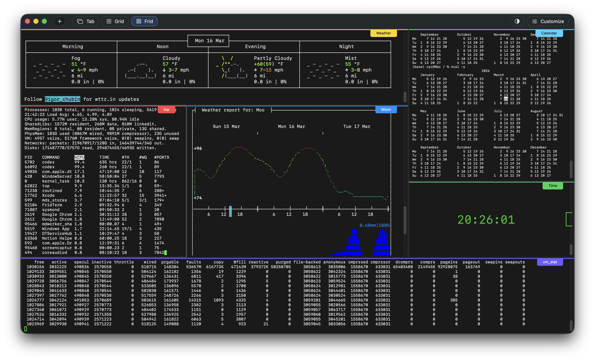
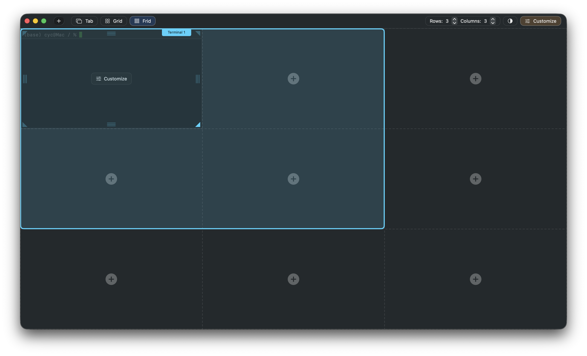
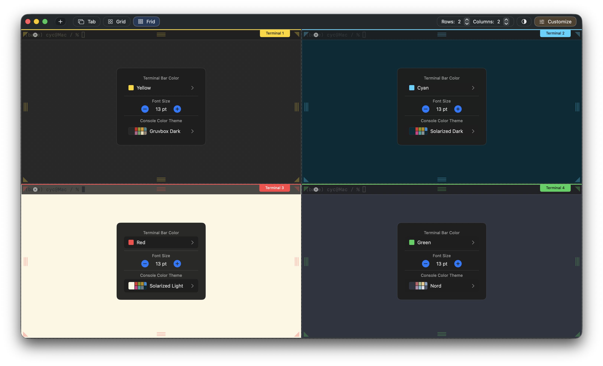
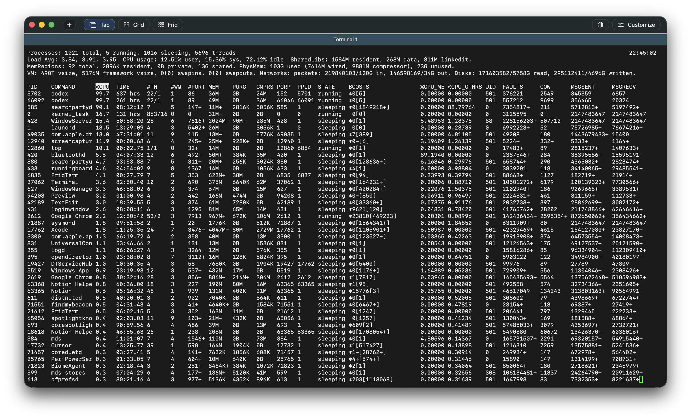
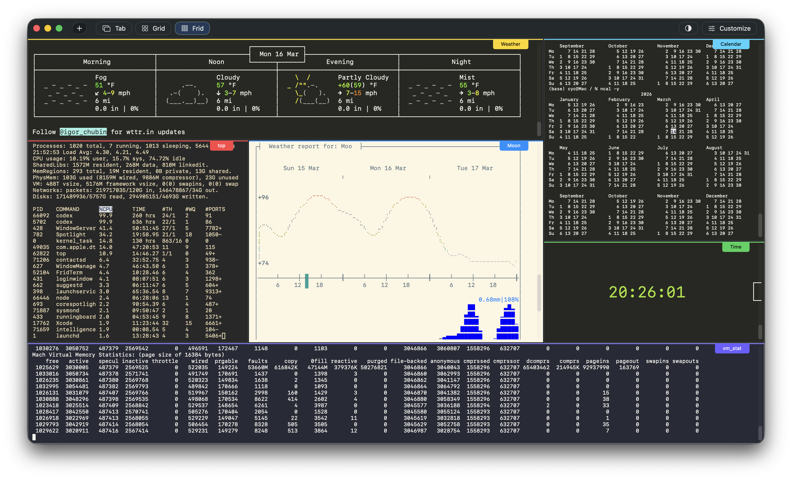

# FridTerm — A Free Flexible Layout Terminal for macOS

FridTerm is a macOS terminal app with a flexible drag-and-drop grid, instant theme customization, and layouts that adapt to the way you work.

## Download

**[Download FridTerm v1.0 for macOS](https://github.com/cchen140/FridTerm/releases/download/v1.0/FridTerm-v1.0-20260315.dmg)**

Have a feature request or workflow problem you want solved? [Tell me here.](https://fridterm.com/ask)

## From the Author

This free terminal app is not meant to be competing with all the prestigious terminal apps out there in the community.
I built it to help my own multi-agent workflow and I add new features as I need, thanks to the help with AI.
If this app happens to be of interest to you, feel free to send feature request to also make it a terminal app that suits your needs.

## Why FridTerm?

Most terminals lock you into fixed splits or tab-only views. FridTerm gives you a workspace you can shape directly with the mouse — move terminals where they belong, create layouts around context, and keep related tasks visible at once.

## Features

**Resize on the fly** — Pull boundaries, expand active work areas, and shrink background panes as your focus changes.

**Live color customization** — Tune terminal appearance without guesswork. Adjust theme colors and see them applied instantly.

**Multiple display modes** — Switch between Tab, Grid, and Frid modes. The same terminal session, shown in the format that fits the moment.

**Flexible grid layout** — Drag terminals into place and build layouts that match your workflow.

